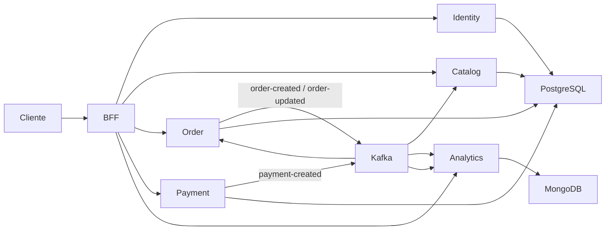

# Plataforma de e-commerce

O projeto implementa uma plataforma de comércio eletrônico distribuída em seis serviços Spring Boot. Este repositório contém o **Backend for Frontend (BFF)**, que expõe uma API única para os clientes e encaminha as solicitações aos serviços de domínio. Cada serviço está em seu próprio repositório.

## Arquitetura



O BFF usa clientes HTTP declarativos (Spring Cloud OpenFeign) para integrar os serviços. Kafka propaga eventos de pedidos e pagamentos, permitindo que os serviços de catálogo e analytics reajam a essas alterações. O serviço de pedidos também atualiza o estado do pedido quando recebe o resultado do pagamento.

## Serviços

| Serviço | Responsabilidade | Repositório |
|---|---|---|
| BFF | API de entrada; encaminha operações de usuários, catálogo, pedidos, pagamentos e analytics. | Este repositório |
| Identity | Usuários, autenticação e emissão de tokens JWT. | [e-commerce-identity-service](https://github.com/wlailson/e-commerce-identity-service) |
| Catalog | Produtos e categorias; reserva/atualiza estoque a partir de eventos de pedidos. | [e-commerce-catalog-service](https://github.com/wlailson/e-commerce-catalog-service) |
| Order | Criação e acompanhamento do ciclo de vida dos pedidos; publica eventos e processa resultados de pagamento. | [e-commerce-order-service](https://github.com/wlailson/e-commerce-order-service) |
| Payment | Processamento de pagamentos com simulador e publicação de eventos de pagamento. | [e-commerce-payment-service](https://github.com/wlailson/e-commerce-payment-service) |
| Analytics | Consome eventos de pedidos e pagamentos e disponibiliza consultas e indicadores de vendas. | [e-commerce-analytics-service](https://github.com/wlailson/e-commerce-analytics-service) |

## Tecnologias

- **Java 25**, **Maven** e **Spring Boot 4.1.1**.
- **Spring MVC**, validação e **Spring Security** com suporte a JWT/OAuth2 Resource Server.
- **Spring Cloud OpenFeign** para chamadas do BFF aos serviços.
- **Apache Kafka** para comunicação assíncrona entre serviços.
- **PostgreSQL**, Spring Data JPA e Flyway nos serviços de identidade, catálogo, pedidos e pagamentos; **MongoDB** no serviço de analytics.
- **Spring Boot Actuator** e **Micrometer Prometheus Registry** para métricas e endpoints de operação nos módulos que incluem essa integração.
- **JUnit Jupiter**, **Mockito** (usado nos testes dos serviços que o incluem) e **Testcontainers** para testes com dependências como PostgreSQL, Kafka e MongoDB.
- **springdoc-openapi / Swagger UI** para documentação HTTP.

**Observabilidade:** os serviços que incluem o registry Micrometer podem expor métricas no endpoint `/actuator/prometheus`. O Prometheus precisa ser configurado para coletá-las. Não há configuração de servidor Prometheus nem provisionamento de dashboards Grafana nestes seis repositórios; o Grafana pode ser conectado a um Prometheus configurado à parte. O serviço de pedidos não declara o registry Prometheus no momento.

## API do BFF

Os recursos do BFF estão agrupados sob estes prefixos:

| Prefixo | Serviço de domínio |
|---|---|
| `/api/users` | Identity |
| `/api/catalog` | Catalog |
| `/api/orders` | Order |
| `/api/payment` | Payment |
| `/api/analytics` | Analytics |

Consulte o Swagger para ver operações, parâmetros e modelos. Com o BFF em execução na porta `8080`, a interface local fica em `http://localhost:8080/swagger-ui/index.html` e o documento OpenAPI em `http://localhost:8080/v3/api-docs`. Os serviços também mantêm suas próprias documentações Swagger; consulte os READMEs individuais.

## Pré-requisitos

- JDK 25.
- Docker quando forem executados testes que usam Testcontainers.
- Serviços de domínio acessíveis por HTTP para chamadas encaminhadas pelo BFF.
- Um par de chaves RSA compatível com os serviços de identidade e validação de JWT.

## Executar localmente

Na raiz deste repositório:

```bash
export SERVER_PORT=8080
export JWT_PUBLIC_KEY='<chave pública RSA em PEM ou Base64, conforme a configuração do serviço>'
export SERVICE_IDENTITY_URL=http://localhost:8081
export SERVICE_CATALOG_URL=http://localhost:8082
export SERVICE_ORDER_URL=http://localhost:8083
export SERVICE_PAYMENT_URL=http://localhost:8084
export SERVICE_ANALYTICS_URL=http://localhost:8085

./mvnw spring-boot:run
```

Inicie cada serviço de domínio no endereço correspondente ou ajuste as variáveis `SERVICE_*_URL` para os endereços usados no ambiente. O BFF não possui banco de dados próprio; persistência e mensageria pertencem aos serviços de domínio.

As URLs podem ser definidas em `src/main/resources/application.yaml`. Não coloque chaves privadas nem credenciais reais no repositório. Os valores de desenvolvimento não devem ser reutilizados em produção.

## Testes

```bash
./mvnw test
```

Os testes de integração que inicializam containers precisam de Docker disponível. Os módulos de catálogo e pedidos também configuram o Maven Failsafe para testes de integração; neles, use:

```bash
./mvnw verify
```

## Configuração e operação

- O BFF usa `SERVER_PORT` (padrão `8080`) e exige `JWT_PUBLIC_KEY`.
- `SERVICE_IDENTITY_URL`, `SERVICE_CATALOG_URL`, `SERVICE_ORDER_URL`, `SERVICE_PAYMENT_URL` e `SERVICE_ANALYTICS_URL` apontam para os serviços de domínio; os padrões locais estão em `application.yaml`.
- A configuração de CORS é controlada por `CORS_ORIGINS` quando aplicável.
- Actuator disponibiliza endpoints de saúde e métricas conforme os endpoints habilitados em cada serviço.

## READMEs dos serviços

- [Identity](https://github.com/wlailson/e-commerce-identity-service#readme)
- [Catalog](https://github.com/wlailson/e-commerce-catalog-service#readme)
- [Order](https://github.com/wlailson/e-commerce-order-service#readme)
- [Payment](https://github.com/wlailson/e-commerce-payment-service#readme)
- [Analytics](https://github.com/wlailson/e-commerce-analytics-service#readme)
